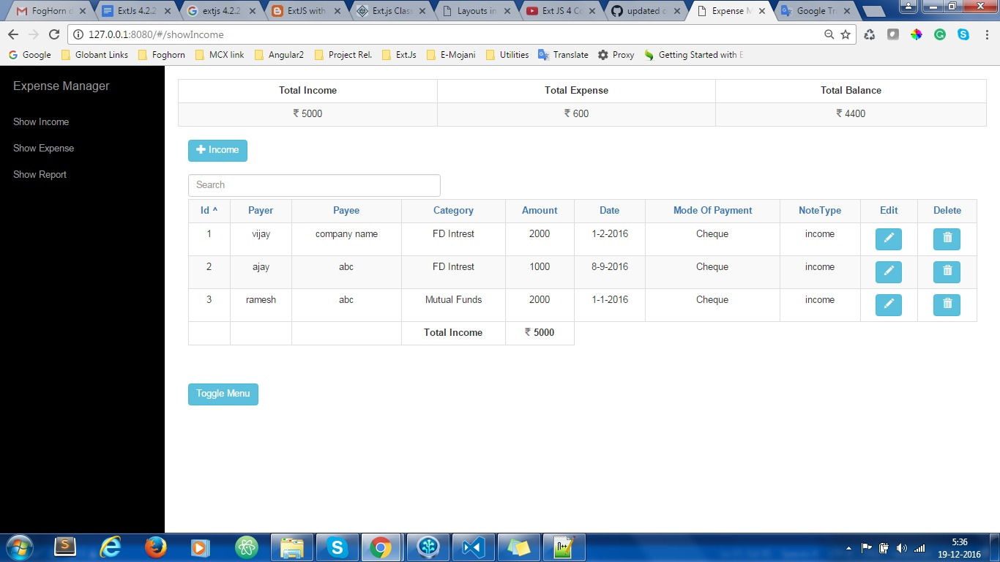
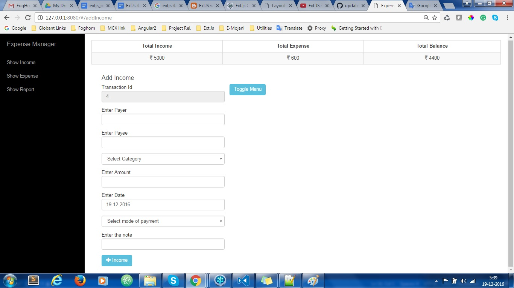
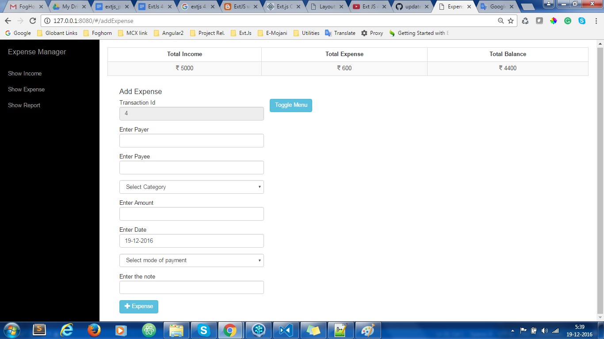
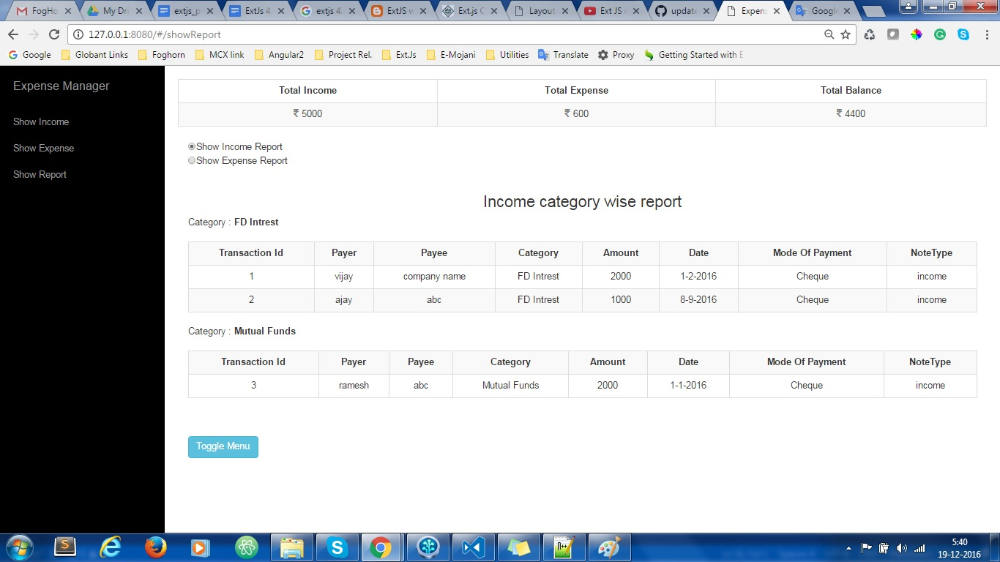

# Ext_JS_POC

### Poc details 

Open <a href="Poc_details.md">Poc_details.md</a> file having all information releated poc that will be develop into ext_js.

### Executing on server

Run `http-server` against your repo.folder to open index.html in your browser.

### Screenshot for poc reference purpose 

    
    
    
    
    
    

